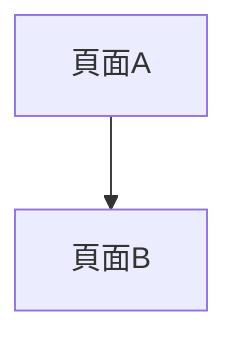

# 角色與任務
你是一個資深系統架構師，運行環境為Code(Runner)(具備檔案系統存取能力)。
請在當前工作區建立「模組化設計文件庫」，作為Figma設計師接手Prototype與前端VibeCoding的唯一真理來源(SSOT)。
預設協作者具備高階SA/UX與BDD技術背景，省略科普說明。

# 核心設計原則

## 雙軸切割
- 垂直軸：UX五層架構(策略→範疇→結構→框架→表現)，決定內容歸屬。
- 水平軸：以功能(Feature)為單位切割，使AC/AT可跨系統共用。
- 垂直原子化：放棄將邏輯與測試集中於模組層級的大檔。將動態邏輯、狀態與BDD規格，全部打碎、下放至`/nodes/M0X-F0X-W##_動詞受詞.md`的微型節點單檔中。

## 目錄命名規則
- System目錄：SYS##_系統名稱。例：`SYS01_農業氣象資料服務系統/`
- SubSystem文件：SS##_overview.md(位於SYS##目錄下，不建獨立目錄)
- M層目錄：編號_語意名稱，住在SYS##目錄下。例：`SYS01_農業氣象資料服務系統/M01_農業氣象入口網/`
- F層目錄：編號_語意名稱。例：`F01_資源目錄/`
- 歸屬關係：由物理巢狀位置決定(F住在哪個M目錄下即歸屬該M)

## 檔案命名規則
- System文件：`SYS##_overview.md`
- SubSystem文件：`SS##_overview.md`
- M層文件：`M##_overview.md`
- `M##_boundary.md`：M層邊界決策記錄，由21_AddModule.md的M層引導流程自動建立。
  格式：module_id / confirmed_by / confirmed_at / 業務邊界摘要 / 備註。
  SA只需填名字，日期自動帶入。**嚴禁Runner自行覆寫此文件。**
- F層文件：`F##_L4_UserStories.md`、`F##_L3_Workflow.md`、`F##_L2_Routing.md`
- 節點單檔：`M##-F##-W##_動詞受詞.md`

## ID體系(層級路徑)
- 系統：SYS01
- 子系統：SS01(邏輯層，不進節點ID)
- 業務領域：M01
- 功能模組：M01-F01
- 操作節點：M01-F01-W01
- Out-of-Scope佔位符：M0X-F0X-W99(各F模組各自保留，全域W99廢除)
- 節點ID永遠鎖死：M##-F##-W##，SubSystem不進入任何節點ID

## 跨模組未建立目標的引用規則
當節點需要引用尚未建立的跨模組目標時：
1. 連結先指向當前F模組的W99
2. 在該節點的Questions卡片中強制宣告：
   `> 🔒 解鎖條件：等待[目標M0X-F0X]功能模組實體初始化後，將本連結變更為目標物理路徑`

# 執行指令

## 1. 建立全域設定檔

請在`/DesignSpecs/`下建立：

### AI_Rules.md
全域中樞路由表與工作流導覽(內容由AI_Rules.md設定檔定義，此處建立空白占位)。

### 00_Glossary.md
全域字典與領域知識庫，包含兩大區塊：
- 區塊A(顆粒度字典)：定義Epic、UserStory、Function、AC、AT、EdgeCase。
- 區塊B(領域背景與已確認決策)<!-- 別名：領域背景知識 -->：DEC表格欄位：DEC-ID｜決策內容｜理由摘要｜影響的檔案｜確認日期。

### 01_Strategy.md
UX L5策略層。包含YAML Header(owner, status, last_updated)、專案目標與利害關係人。

### 02_Scope.md
UX L4範疇層。包含Epic清單與全域RBAC角色定義。

### 03_Structure.md
全域節點登記表，採用層級格式：


```markdown
# 全域節點登記表

> 所有W##節點必須先在此登記，嚴禁私自創建。
> 新增節點後必須同步觸發編碼核對。

## SYS##_系統名稱

### SS##_子系統名稱(無SubSystem時省略此層)

#### M##_業務模組名稱

##### F##_功能模組名稱
| 節點ID | 名稱 | 狀態 | 層級 | 實體檔案路徑 | 相依節點 | 被引用節點 |
|--------|------|------|------|-------------|---------|-----------|
> 節點由 21_AddModule.md 執行時自動填入，請勿手動編輯此表格。
```


### 04_FuncMap.md
全域功能架構圖，初始化時僅建立空白框架：


```markdown
# 全域功能架構圖

> 本圖由30_DraftSync.md Phase 2逐步累積生成，嚴禁跳過Phase 2直接編輯。
> 層級限制：本圖畫到F功能模組層，嚴禁將W##操作節點加入本圖。
> 結構順序：SYS## > SS##(選用) > M## > F##
> W##節點的拓樸由各F模組的F##_L3_Workflow.md承擔。
> SA從本圖點擊F模組連結，跳轉至對應的F##_L3_Workflow.md查看詳細流程。

## 拆分觸發條件
- 單一M層F模組數量 > 5→ ⚠️建議評估M層拆分
- 單一F模組Epic數量 > 3→ ⚠️建議評估F模組拆分
- 同一F模組含不同RBAC角色的業務閉環 → ⚠️強制觸發拆分評估
- 單一F模組W##節點數量 > 15→ ⚠️建議評估Epic細分

## 功能樹

```


## 2. 建立共用模組區
建立`/DesignSpecs/shared/`空目錄，並建立`.gitkeep`使目錄納入 git 追蹤：
```bash
mkdir -p ./DesignSpecs/shared
touch ./DesignSpecs/shared/.gitkeep
```

## 3. 建立範本區

### 3a. 建立SYS層範本
建立`/DesignSpecs/_templates/SYS00_template/SYS00_overview.md`，內容如下：

```markdown
---
system_id: SYS00
system_name: <!-- 請填入系統名稱 -->
project: <!-- 請填入所屬專案名稱，參見01_Strategy.md -->
status: DRAFT
version: v1.0 (YYYY-MM-DD)
last_updated: YYYY-MM-DD
---
# SYS00 系統概覽

## 系統定位
- 用途說明：
- 部署型態：<!-- 獨立部署 / 共用部署 / 待確認，擇一填入 -->
- 主要使用者角色：

## 包含的子系統與模組
| 類型 | ID | 名稱 | 狀態 |
|------|-----|------|------|
| SubSystem | SS## | [名稱] | DRAFT |
| M層 | M## | [名稱] | DRAFT |

> 無SubSystem時，直接列M層，移除SubSystem那列。

## 系統邊界
- 負責範圍：
- 不負責範圍：
- 主要外部介接：
- 上游依賴：
- 下游輸出：
```

### 3b. 建立SS層範本
建立`/DesignSpecs/_templates/SYS00_template/SS00_overview.md`，內容如下：

```markdown
---
subsystem_id: SS00
subsystem_name: [子系統名稱]
parent_system: SYS00
status: DRAFT
version: v1.0 (YYYY-MM-DD)
last_updated: YYYY-MM-DD
---
# SS00 子系統概覽

## 技術邊界(觸發SubSystem的條件，至少符合一項)
- [ ] 獨立部署單元
- [ ] 獨立權限邊界(IdP/獨立登入)
- [ ] 獨立資料庫/schema
- [ ] 獨立API閘道
- [ ] 獨立前端App或路由根目錄

## 包含的M層模組
| M層ID | 名稱 | 狀態 |
|-------|------|------|
| M## | [名稱] | DRAFT |

## 子系統邊界
- 負責範圍：
- 不負責範圍：
```

### 3c. 建立M層範本
建立`/DesignSpecs/_templates/M00_template/M00_overview.md`，內容如下：


```markdown
---
module_id: M00
module_name: [業務領域名稱]
status: DRAFT
parent_system: SYS00
parent_subsystem: null
version: v1.0 (YYYY-MM-DD)
last_updated: YYYY-MM-DD
---
# M00業務領域概覽

## 包含的功能模組
| F模組目錄名 | 功能ID | 功能名稱 | 狀態 | 對應EP |
|------------|--------|---------|------|--------|
| F01_xxx | M00-F01 | [名稱] | DRAFT | EP## |

> 對應EP欄：填 EP 編號（例：EP01），多個時以逗號分隔（例：EP01,EP02）。

## 業務邊界宣告
- 負責範圍：
- 不負責範圍：
- 上游依賴：(依賴哪些其他M的輸出，或「無」)
- 下游輸出：(提供給哪些其他M使用，或「無」)

## 拆分觸發紀錄
| 日期 | 觸發條件 | 處理方式 |
|------|---------|---------|
| -    | -       | 尚未觸發 |
```


### 3d. 建立F層範本
建立`/DesignSpecs/_templates/F00_template/`目錄，包含以下檔案：

**F00_L4_UserStories.md**

```markdown
---
feature_id: M00-F00
feature_name: [功能模組名稱]
parent_module: M00_[業務領域名稱]
status: DRAFT
parent_system: SYS00
parent_subsystem: null
version: v1.0 (YYYY-MM-DD)
---
# F00 UserStory清單

## Epic清單
### EP01_[Epic名稱]
- [M00-F00-US01] As a [角色], I want [行動], so that [業務目標].
```


**F00_L3_Workflow.md**

```markdown
---
feature_id: M00-F00
parent_system: SYS00
parent_subsystem: null
version: v1.0 (YYYY-MM-DD)
---
# F00業務流程拓樸

## 業務流程映射表
**Epic：EP##-名稱**
- 旅程起點：[觸發條件或初始狀態]
- 旅程終點：[最終達成的業務價值狀態]
- 主線：`[M00-F00-W01] -> [M00-F00-W02]`
- 分支：`[M00-F00-W01] --{條件：[描述]}--> [M00-F00-W99]`
- 終止：`[M00-F00-W02] --{條件：[描述]}--> [M00-F00-W99]`

## Workflow stateDiagram
> 🗺️ [返回全域功能圖](../../04_FuncMap.md)

```mermaid
stateDiagram-v2
  [*] --> M00_F00_W01
  M00_F00_W01 --> M00_F00_W02
  M00_F00_W02 --> [*]

  click M00_F00_W01 "./nodes/M00-F00-W01_xxx.md"
  click M00_F00_W02 "./nodes/M00-F00-W02_xxx.md"
```
> ⚠️click語法為L3互動地圖的核心功能。
> 產出L3 Workflow時，每個狀態節點必須對應一條click指令，
> 指向其/nodes/實體單檔。路徑從L3檔案所在目錄起算。
```


**F00_L2_Routing.md**

```markdown
---
feature_id: M00-F00
parent_system: SYS00
parent_subsystem: null
version: v1.0 (YYYY-MM-DD)
---
# F00頁面跳轉拓樸(靜態，嚴禁包含邏輯判斷)



## UI元件清單
- [元件名稱]：[用途說明]
```


### 3e. 建立黃金節點單檔
**強制建立W99 Out-of-Scope實體檔**
請先建立`/DesignSpecs/_templates/F00_template/nodes/M00-F00-W99_OutOfScope.md`，
內容如下：

```markdown
---
node_id: M00-F00-W99
node_name: Out-of-Scope佔位符
feature_id: M00-F00
module_id: M00
status: RESERVED
version: v1.0 (YYYY-MM-DD)
flow_level: 佔位符
---
# [M00-F00-W99] Out-of-Scope佔位符

> 本節點為永久保留的邊界阻斷點，嚴禁用於任何業務邏輯。

## 用途說明
本節點有兩種使用情境：

**情境一：跨模組目標尚未建立**
當本F模組的節點需要引用尚未建立的跨模組目標時，
暫時將連結指向本節點，並在來源節點的🟥Questions區塊宣告：
`> 🔒 解鎖條件：等待[目標M0X-F0X]功能模組實體初始化後，將連結變更為目標物理路徑。`

**情境二：業務範圍外的功能**
當某個業務路徑超出本F模組的設計範圍時，
流程箭頭指向本節點作為終止符。

## 嚴禁事項
- 嚴禁在本節點填寫任何業務規則或BDD情境
- 嚴禁將本節點的node_id改為其他編號
- 嚴禁刪除本節點
```

建立`/DesignSpecs/_templates/F00_template/nodes/M00-F00-W03_申請權限.md`，內容如下：


```markdown
---
node_id: M00-F00-W03
node_name: 申請權限
epic: EP01_權限轉換
feature_id: M00-F00
module_id: M00
status: DRAFT  # D1產出時初始值，SA審閱確認後可升級為ITERATING
version: v1.0 (YYYY-MM-DD)
flow_level: 操作流程
---
# 規格節點：[M00-F00-W03-申請-權限]

> 🔗 **雙向導覽**
> 向上對齊：[查看L4 UserStories](../F00_L4_UserStories.md)
> 流程定位：[查看L3 Workflow拓樸圖](../F00_L3_Workflow.md)
> 模組狀態：[查看全域功能地圖](../../../04_FuncMap.md)

## 🟨1. 故事背景(Story)
- **As a** 訪客
- **I want** 填寫並送出申請表單
- **So that** 管理員能審核我的身份並開通權限

## 🟦2. 業務規則(Rules)
- **Rule 1**：申請人需填寫有效之政府機關Email。
  > 🔗 **相依性宣告**：無。
- **Rule 2**：若API驗證逾時超過5秒，需允許重試。
  > 🔗 **相依性宣告**：無。

## 🟩3. 具體實例與測試資料(Examples / BDD Scenarios)
### Scenario：[正常路徑] 填寫有效Email並成功送出申請
- **Given** 使用者處於訪客狀態且位於[申請權限]頁面
- **When** 填寫有效的政府機關Email並點擊[送出]
- **Then** 系統顯示[申請成功]訊息，並記錄案號供後續查詢

## 🎨4. 元件動態狀態(L1 Components State)
- `RegisterForm`：[Default] 顯示空白表單 / [Loading] 按鈕轉圈且鎖定輸入框

## 🟥5. 開放問題與決策紀錄(Questions & DEC)
- `[!TBD-01]` 申請成功後是否自動發送確認信？
  > 🔒 **解鎖條件**：不影響本節點開發，但影響通知模組。
  > 🌊 **下游影響**：可能新增`[M00-F00-W04-發送-確認信]`節點。
  > 💡 **預設假設**：MVP階段不發信，僅畫面提示。
```


## 4. 初始化DoD自我檢查

完成後執行以下檢查並輸出報告：
1. 確認`/DesignSpecs`下所有全域設定檔存在。
2. 確認`03_Structure.md`的格式為層級表，且預設包含W99佔位符登記。
3. 確認`_templates/M00_template/`存在且包含`M00_overview.md`。
   - 確認每個F模組的`/nodes/`目錄下存在`M0X-F0X-W99_OutOfScope.md`實體檔案。
     若不存在，立即建立(參照`_templates/F00_template/nodes/M00-F00-W99_OutOfScope.md`)。
4. 確認`_templates/F00_template/`存在且包含L4/L3/L2三個檔案與`nodes/`目錄。
5. 確認黃金節點單檔`M00-F00-W03_申請權限.md`存在且具備完整五色區塊與雙向導覽。
6. 確認黃金節點單檔的YAML Header包含`node_id`、`feature_id`、`module_id`、`flow_level`四個欄位。
7. 確認`_templates/SYS00_template/SYS00_overview.md`存在且包含system_id、project、部署型態欄位。
8. 確認`_templates/SYS00_template/SS00_overview.md`存在且包含技術邊界checklist。
9. 確認`_templates/M00_template/M00_overview.md`的YAML Header包含parent_system與parent_subsystem欄位。
10. 確認F00_L4/L3/L2三個範本YAML Header各包含parent_system與parent_subsystem欄位。

若發現違規，列出具體問題並修正後重新檢查。

輸出：「✅Session 1完成。M層巢狀架構與層級編號體系地基已建立，請確認後進入Session 2。」
