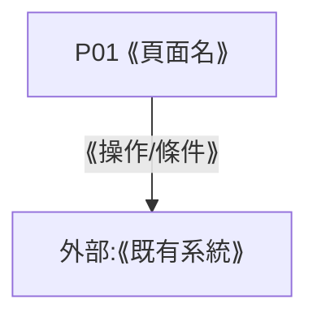

# F00 UI Flow 與頁面登記表

## 導覽主軸

- **主軸**:⟪一句話,如「應用情境導向」⟫
- **DEC 依據**:⟪DEC-NAV-###,對齊 00_Glossary 區塊B;無 DEC 不得開畫⟫

## 旅程假說(引對題審 T0~T2 證據)

- 使用者帶著什麼來:⟪⟫
- 要完成什麼:⟪⟫
- 第一步要看到什麼:⟪⟫
- 何時算完成:⟪⟫

## 旅程段表

> 每條 US 恰歸一主段;共享須明示。段名屬領域相依,不得照抄他案。

| 段 | 進入條件 | 離開條件 | 掛載 US | 掛載 W |
|----|---------|---------|---------|--------|
| ⟪段名⟫ | ⟪⟫ | ⟪⟫ | US## | W## |

## 頁面登記表(含資訊配置欄)

> 先登記後產檔。主任務/primary action/頁面主題/放的資訊/明確不放=全頁必填;
> 首訪/回訪=入口級頁面必填(自 external 或首頁入邊、導覽軸根節點);空欄不得開畫。
> 配置邊界:只記呈現分配,不改 SA 事實;涉 SA 事實修改→登回補帳(90_Backfill)。
> 階段=wire / styled / prototype(產品視圖產出後改 prototype,UIV-01 驗 proto 檔;45_PrototypeView)。

| P## | 頁面名 | 承載 W## | 主任務(來源) | primary action | 頁面主題 | 放的資訊(W##.段;單節點頁可 `*`) | 明確不放(+去處) | 首訪路徑 | 回訪路徑 | 階段 | 檔案路徑 |
|-----|--------|---------|-------------|----------------|---------|------|------|------|------|------|---------|
| P01 | ⟪名⟫ | M00-F00-W01 | ⟪唯一主任務⟫(EP01) | ⟪主行動字面⟫ | ⟪一句⟫ | ⟪W01.功能說明⟫ | ⟪X→P02⟫ | ⟪⟫ | ⟪⟫ | wire | pages/P01_⟪名⟫.html |

## 配置快審紀錄(實例化前)

- 主題互異:⟪過/不過⟫|明確不放去處可解析:⟪⟫|雙讀者欄與旅程假說一致:⟪⟫|旅程段×US 映射完備:⟪⟫
- 阻塞項:⟪無/列出並上拍板⟫

## 頁面流

> 節點=P##;每個 P## 一條 click 指向實體檔;外部與暫緩路徑明確標型。
> 走通檢核:每條 BDD Scenario 的路徑必須能在本圖走出來。
> 與 L2 邊拓樸之差異→「L2 拓樸差異摘要」(90_Backfill)。

