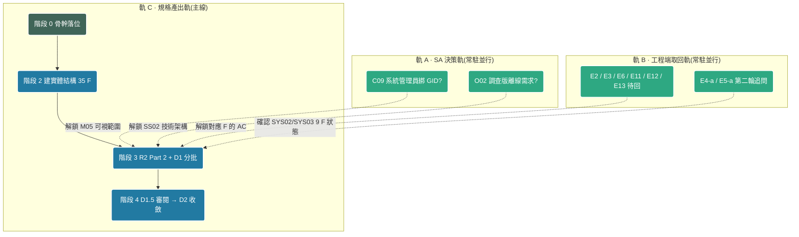

# SA 作業路線圖(Roadmap)

> **本檔管「全局路線與出場條件」,`00_Status.md` 管「當前位置」。**
> 兩者職責不重疊:要知道「現在在哪、下一步做什麼」看 `00_Status.md`;要知道「整條路怎麼走、這一階段做到什麼程度才算完」看本檔。
> 依 `AI_Rules.md` §5 條 4 決策與脈絡分離之精神,同一事實不雙重維護 —— 本檔不複寫 `00_Status.md` 的當前狀態,只寫路線與判準。

**本版範圍**:只排**順序與依賴**,不排日期、不估工時。理由:6 項工程端取回未回、9 個 F 的實作狀態為推定,此時填日期等於填假資料。

---

## 1. 全局視圖:五階段 × 三並行軌

現行 `00_Status.md` 把階段 1 寫成階段 2 的序列前置,**這是過度序列化**。實際上階段 1 只有「架構定案」一項是階段 2 的硬前置,而該項已由 DEC-006 / DEC-009 / DEC-010 拍定。其餘的決策拍板與工程端取回,性質是**常駐並行軌**,不該擋住實體結構的建立。



**關鍵讀法**:軌 A / 軌 B 的箭頭是**虛線**,指向階段 3 而非階段 2 —— 它們阻塞的是「某些 F 的驗收條件(AC)寫不寫得出來」,不阻塞「建目錄與登記 ID」。因此**階段 2 現在就能啟動**,不必等 E 系列回完。

### 階段代號與現況

| 階段 | 名稱 | 狀態 | 阻塞 |
|---|---|---|---|
| 階段 0 | 骨幹落位(`01_Strategy` / `02_Scope` 轉 ACTIVE) | ✅ 完成(2026-08-31) | — |
| 階段 1 | 決策清倉與外部發包 | 🔄 **轉為常駐並行軌 A / B** | 見 §4 阻塞矩陣 |
| 階段 2 | 建實體結構(35 F) | ⬜ **入場條件已滿足,可啟動** | 無 |
| 階段 3 | R2 Part 2 + D1(分批) | ⬜ 待階段 2 出場 | 部分批次受軌 A / B 阻塞 |
| 階段 4 | D1.5 審閱 → D2 收斂(逐批) | ⬜ 待各批 D1 完成 | — |

> **階段 1 的處置**:不再視為一個需要「完成」的序列階段,改列為兩條常駐軌。原「階段 1 出場」的概念改由 §4 阻塞矩陣逐項追蹤 —— 每一項未回的 E 或未拍的 C,只要在矩陣裡有明確的影響範圍與並行路徑,就不構成主線阻塞。

---

## 2. 逐階段入場與出場條件

每階段固定四欄:**入場條件 / 工作項 / 出場條件(可驗收) / 未解阻塞時的並行路徑**。
出場條件一律寫成**可逐項核對的事實**,不寫「做完就好」。

### 階段 2 · 建實體結構(35 F)

**入場條件**(全數已滿足)

- [x] 架構定案:3 SYS / 4 SS / 10 M / 35 F(`06_HandoffPackage.md` §4)
- [x] SS 切分拍板:SYS01 → SS01/SS02(DEC-006);SYS02 → SS03/SS04(DEC-010)
- [x] `01_Strategy.md` / `02_Scope.md` 為 ACTIVE(階段 0 產出)
- [x] `_templates/` 三套範本齊備(SYS00 / M00 / F00)

**工作項**

執行 `21_AddModule.md`,分三批:**SYS01(26 F)→ SYS03(3 F)→ SYS02(6 F)**。
取值來源為 `06_HandoffPackage.md` §4(架構分解),不得另行推導。

**出場條件(可驗收)**

- [ ] `DesignSpecs/` 下存在 3 個 `SYS##/` 目錄,各含 `SYS##_overview.md`
- [ ] 4 個 `SS##_overview.md` 已實例化(SS01 / SS02 於 `SYS01/`,SS03 / SS04 於 `SYS02/`)
- [ ] 10 個 `M##/` 目錄,各含 `M##_overview.md`
- [ ] 35 個 `F##/` 目錄,各含 `F##_L4_UserStories.md` / `F##_L3_Workflow.md` / `F##_L2_Routing.md` 三檔骨架
- [ ] `03_Structure.md` 登記 35 個 F 與各 F 的 `M##-F##-W99` 佔位節點(狀態 `RESERVED`)
- [ ] `04_FuncMap.md` 功能樹已生成,拆分閾值自檢通過
- [ ] 各 `SYS##_overview.md` 的「部署型態」欄已就地標 `[!TBD-DEPLOY-01]`(等 E13)
- [ ] 範本內相對路徑字面值已依 `AI_Rules.md` §4.5 物理層級對照表逐層替換

**已知地雷**

- ✅ **範本目錄大小寫已於 2026-09-01 修正**(commit 見 git log)。原況:部署包鋪的目錄為 `F00_Template/` / `M00_Template/` / `SYS00_Template/`(大寫 T),而 KIT 全篇 18 處引用皆為小寫 `_template/`,Windows 靜默通過、Linux / CI 會 fail。處置:改 3 個目錄名為小寫,不動 KIT 字面值 —— 依據是 `20_Setup.md` 第 410~418 行的驗收檢查逐條寫小寫路徑,repo 現況跑不過套件自己的驗收。詳見 §5 R2。
- ⚠️ **M03 已達 F 數警示邊緣**(現 5 F)。`AI_Rules.md` §5 條 5 的觸發條件是「單一 F 模組對應 Epic 數 > 3」而非 M 底下的 F 數;M03 五個 F 分屬 EP06 / EP07 / EP08,各 F 對應 Epic 數皆 ≤ 3,**未觸發拆分**。本階段仍須複查一次並在 `04_FuncMap.md` 留下自檢結論,避免階段 3 展開後才發現。

**未解阻塞時的並行路徑**:無阻塞,直接跑。

---

### 階段 3 · R2 Part 2 + D1(分批)

**入場條件**

- [ ] 階段 2 出場條件全數核對通過
- [ ] 本批焦點 F 已由 SA 指定(取值見 §3 分批順序表)

**工作項**

逐批執行,每批兩步:

1. **R2 Part 2** —— 產出該批 F 所屬 Epic 的業務流程映射表(旅程起點 / 終點 / 主線 / 分支 / 終止)。依 `10_ReqAnalysis.md` §4,此表為 L3 Workflow stateDiagram 的**唯一授權來源**。
2. **D1** —— 執行 `30_DraftSync.md`,依序生成 L4 / L3 / L2 靜態草稿與原子化節點單檔。

**出場條件(逐批可驗收)**

- [ ] 該批每個 F 的 `F##_L4_UserStories.md` / `F##_L3_Workflow.md` / `F##_L2_Routing.md` 已由骨架轉為草稿內容
- [ ] `nodes/M##-F##-W##_動詞受詞.md` 節點單檔齊備,節點狀態為 `S1_DRAFT`
- [ ] 新增節點**已先在 `03_Structure.md` 登記**(`AI_Rules.md` §5 條 1,嚴禁私自創建)
- [ ] 受阻塞項已就地標 `[!TBD-*]` 並附解鎖條件與下游影響(§5 條 3,**嚴禁另建外部 TBD 表格**)
- [ ] 跨模組未建立之引用已依 §5 條 10 / 條 11 指向本 F 的 `W99` 並標 `[!CROSS-LINK → M##-F##-W##]`
- [ ] 已依 §5 條 6 惡魔模式盤點資料異常 / 權限衝突 / 狀態死結三類 Edge Case

**未解阻塞時的並行路徑**

這是本 Roadmap 最重要的一節。**E 系列未回不等於停工** —— 分批順序表(§3)已把 35 F 依「是否受阻塞」排序,批 1~批 4 共 18 個 F **完全不受任何未回項阻塞**,足以支撐相當長的產出期。受阻塞的 F 一律採「就地 `[!TBD]` + 續行」,不中斷等待(`AI_Rules.md` §3 決策樹:遇未知邏輯強制套用預設假設,不中斷等待)。

---

### 階段 4 · D1.5 審閱 → D2 收斂(逐批)

**入場條件**

- [ ] 該批 D1 出場條件通過
- [ ] `F##_REVIEW.md` 儀表板已產出

**工作項**

逐 F 走狀態機 `S1_DRAFT → S2_ITERATING → S3_READY_SYNC → S4_SYNC_DONE`。
D1.5 期間 SA **可直接修改**實體檔案(這是設計行為,非變更管理行為,見 §5 條 8)。
D2 收到「繼續同步」指令後執行覆蓋率驗證與四維編碼核對。

**出場條件(逐批可驗收)**

- [ ] 該批全部 F 的節點狀態為 `S4_SYNC_DONE`
- [ ] **四維編碼核對通過**:`03_Structure.md` / `02_Scope.md` / `/nodes/` 實體檔案 / `F##_L3_Workflow.md` 四者一致 —— 無**死節點**(有檔案但未入流程圖)、無**幽靈節點**(在流程圖但無實體檔案)
- [ ] `04_FuncMap.md` 雙向連結已更新
- [ ] D2 引用報告列出的 `[!CROSS-LINK]` 未回填清單已交 SA 追蹤
- [ ] 全域決策表已更新

**未解阻塞時的並行路徑**

D1.5 期間若 SA 增刪 `M##-F##-W##` 節點,**必須手動同步 `03_Structure.md`**,否則 D2 四維核對必 fail。此為已知高頻失誤點。

---

### 全流程結束後 · 交接包退役與交付剝離

`06_HandoffPackage.md` 為**中繼檔**,消費完畢即退役。追蹤表:

| 章節 | 內容 | 消費者 | 狀態 |
|---|---|---|---|
| §1 設計邊界 | In / Out-of-Scope、硬限制 | 階段 0 `02_Scope.md` | ✅ 已消費 |
| §2 角色與動機 | 9 個 RBAC 角色 | 階段 0 `01_Strategy.md` | ✅ 已消費 |
| §3 設計優先級 | 35 F 實作狀態 / 工作性質 / 優先級 | **階段 3**(本檔 §3 分批順序表) | ⬜ 未消費 |
| §4 架構分解 | SYS / SS / M / F | **階段 2** `03_Structure.md` / `04_FuncMap.md` | ⬜ 未消費 |
| §5 Epic 清單 | 15 EP | 階段 0 `02_Scope.md` | ✅ 已消費 |
| §6 工程前置決策點 | E 系列 | **軌 B** `EngRegister.md` | ⬜ 未消費(仍在追回) |
| §7 交接至 Runner | 風險情境 / 跨模組關聯 / shared 建議 | **階段 3** 惡魔模式載入 | ⬜ 未消費 |

**退役條件**:§3 / §4 / §6 / §7 全數轉綠。退役後依 `AI_Rules.md` §5 條 12 執行交付剝離 —— 另建交付副本目錄僅含 `DesignSpecs/`,剝離 `.metasa/` / `00_START_SA/` / `CLAUDE.md` / `AGENTS.md`,**嚴禁在工作庫內就地刪除**。

---

## 3. 35 F 分批展開順序表

**排序判準**(依序套用,前者優先)

1. **是否受未回項阻塞** —— 不受阻塞者先行。未回項不擋主線是本 Roadmap 的設計前提。
2. **優先級** —— P1 → P2 → P3(來源 `06_HandoffPackage.md` §3)。
3. **依賴鏈方向** —— 資料起點先於消費端(如 M04-F01 先於 M04-F04)。
4. **實作狀態確定性** —— 工程端確認者先於推定者(9 個 ⚠️ 推定 F 排在最後,等 E4-a)。

> ⚠️ 本表是**規格產出順序**,不是開發上線順序。兩者不同,別混用。

| 批 | F | 名稱 | 優先 | 工作性質 | 阻塞 | 排此批的理由 |
|---|---|---|---|---|---|---|
| **批 1** | `SYS01-M01-F03` | 廠商群組管理 | **P1** | 🆕 新建 | 無 | 風險閉環一半:GID 目前靠人工改 DB;EP03 權限治理流程起點 |
| **批 1** | `SYS01-M07-F01` | 稽核紀錄 | **P1** | 🆕 新建 | 無(E8 已結案) | 風險閉環另一半:改權限不留痕。**與 M01-F03 綁在一起做**,只做一項風險只解一半 |
| **批 2** | `SYS01-M04-F01` | 維養紀錄 | **P1** | 🆕 新建 | 無(E7 已結案) | M04 資料起點,F04 依賴其產出;素材密度最高(6 大類 + 13 工法);DEC-004 已給雙填報路徑既有範式 |
| 批 3 | `SYS01-M04-F02` | 測量紀錄 | P2 | 🔁 歸位 | 無 | **架構映射錯位**,功能存在但落在 M03 畫面。與批 2 同屬 M04,一起處理歸位邊界 |
| 批 3 | `SYS01-M04-F03` | 健康調查與病蟲害 | P2 | 🆕 新建 | 無 | 缺口 G02;與 F01 / F02 同屬 EP09 植栽歷程 |
| 批 3 | `SYS01-M02-F03` | 航照圖管理 | P2 | 🆕 新建 | 無(E8 已結案) | 缺口 G05;EP05 獨立閉環,不依賴他 F |
| 批 3 | `SYS01-M06-F02` | 碳匯儀錶板 | P2 | 🆕 新建 | 無 | DEC-008 確認未實作;R3 業主長官唯一成果視圖;M02-F04 依賴其先行 |
| 批 3 | `SYS01-M07-F02` | 系統設定 | P2 | 🆕 新建 | 無(E8 已結案) | 缺口 G08;與批 1 同屬 EP12,共用維運語彙 |
| 批 4 | `SYS01-M01-F01` | 登入與工作區切換 | P3 | 📋 補規格 | 弱(E5-a,不阻塞) | EP02 為所有 Epic 前置,雖 P3 但地基性質,宜早不宜晚 |
| 批 4 | `SYS01-M01-F02` | 帳號管理 | P3 | 📋 補規格 | 無(DEC-011 已定雙層權限) | 與 F01 / F03 同屬 EP03,一批處理權限語彙 |
| 批 4 | `SYS01-M01-F04` | 個人資料維護 | P3 | 📋 補規格 | 無 | 同 M01,順帶 |
| 批 4 | `SYS01-M02-F01` | 案場管理 | P3 | 📋 補規格 | 無 | EP04 歸屬鏈起點(DEC-005) |
| 批 4 | `SYS01-M02-F02` | 分區管理 | P3 | 📋 補規格 | 無 | EP04;GID 權限邊界落在此層,與批 1 呼應 |
| 批 4 | `SYS01-M03-F01` | 植栽查詢與檢視 | P3 | 📋 補規格 | 無 | EP06 / EP08;現行測量入口在此,與批 3 歸位相關 |
| 批 4 | `SYS01-M03-F02` | 植栽建檔 | P3 | 📋 補規格 | 無 | EP06 |
| 批 4 | `SYS01-M03-F03` | 植栽批次匯入 | P3 | 📋 補規格 | 無(E8 已結案) | EP07;**無批次表,匯入不可追溯**(G10)—— 補規格時須納入 to-be 批次表 |
| 批 4 | `SYS01-M03-F04` | 植栽資料匯出 | P3 | 📋 補規格 | 無 | EP07 |
| 批 4 | `SYS01-M03-F05` | 圖台查詢與顯示規則 | P3 | 📋 補規格 | 無 | EP08 |
| 批 5 | `SYS01-M05-F01` | 任務建立與派工 | P3 | 📋 補規格 | 🔴 **E6 / C09** | 系統管理員是否綁 GID 未定 → 可視範圍寫不出 AC |
| 批 5 | `SYS01-M05-F02` | 任務執行與日誌 | P3 | 📋 補規格 | 🔴 **E2** | 十狀態判斷邏輯未回;DEC-002 已排除舊判斷式,無替代來源 |
| 批 5 | `SYS01-M05-F03` | 任務審核與結案 | P3 | 📋 補規格 | 🔴 **E2** | 同上 |
| 批 5 | `SYS01-M06-F01` | 固碳量計算 | P3 | 📋 補規格 | 🔴 **E3** | 計算式 / 樹種係數 / 生物量取得皆未回(DEC-003) |
| 批 6 | `SYS01-M02-F04` | 總覽入口 | P3 | 🆕 新建 | 依賴批 3 | 需嵌入 M06-F02 碳匯儀錶板呈現區塊 |
| 批 6 | `SYS01-M04-F04` | 歷程資料管理 | P3 | 🆕 新建 | 依賴批 2 / 批 3 | 依賴 M04-F01 / F03 先產出資料 |
| 批 6 | `SYS01-M06-F03` | 碳匯資料管理 | P3 | 🆕 新建 | 依賴批 3 | 依賴 M06-F02 先行 |
| 批 6 | `SYS01-M07-F03` | 自訂規則 | P3 | 🆕 新建 | 依賴批 1 / 批 4 | 缺口 G11;DEC-008「角色自訂」屬未開發完成,須先有 M01 權限語彙定案 |
| 批 7 | `SYS03-M01-F03` | SEO 與效能 | P2 | 🔧 改善 | 弱(E4-a) | 行動版 PageSpeed 57 / LCP 10.5s(驅動因素 D7);改善型指標明確,推定被推翻的影響最小 |
| 批 7 | `SYS03-M01-F01` | 內容展示 | P3 | 📋 補規格 | 弱(E4-a) | EP15 |
| 批 7 | `SYS03-M01-F02` | 合作洽談與試用申請 | P3 | 📋 補規格 | 弱(E4-a) | **EP01 跨系統鏈起點**;`D_ContactList` / `M_TrialInfo` 已有表 |
| 批 8 | `SYS02-M02-F01` | Token 與 SSO 登入 | P2 | 🆕 新建 | 弱(E4-a) | SS04 進入點,EP13 前置 —— SYS02 內部先行項 |
| 批 8 | `SYS02-M01-F01` | 試用申請審核 | P2 | 🆕 新建 | 弱(E4-a) | **EP01 鏈中段**;`M_TrialInfo` 有表,審核介面未見 |
| 批 8 | `SYS02-M01-F02` | 訂閱用戶管理 | P2 | 🆕 新建 | 弱(E4-a) | EP14 |
| 批 8 | `SYS02-M02-F02` | 授權方案檢視 | P2 | 🆕 新建 | 弱(E4-a) | **E9 三個「沒有」已回** → to-be 從零設計,無 as-is 包袱 |
| 批 8 | `SYS02-M02-F03` | 方案購買與切換 | P3 | 🆕 新建 | 依賴 F02 | 依賴額度機制先行 |
| 批 8 | `SYS02-M02-F04` | 成員管理 | P3 | 🆕 新建 | 🔴 **E12** | 邀請預設 Role 與 Group 指派規則未回;DEC-009 排除 p2 路徑四後無替代來源 |
| 批 6 | `SYS01-M04-F05` | 汰換與物種適生分析 | P3 | 🆕 新建 | 🔴 **E15** | **Backlog 增補**。與 M04-F04 同批(同屬狀態歷程);無狀態異動歷史則無資料可分析 |
| **批 9** | `SYS01-M08-F01` | 公開植栽檢視 | P2 | 🆕 新建 | 無 | **Backlog 增補**。SS05 進入點,匿名讀取,不依賴他 F |
| **批 9** | `SYS01-M08-F02` | 外部照片上傳與審核 | P2 | 🆕 新建 | 🔴 **E17** | **Backlog 增補**。`F_Photo` 無審核欄位,審核機制無處落 |

**批次統計勾稽**

| 批 | F 數 | 累計 | 受阻塞 |
|---|---|---|---|
| 批 1 | 2 | 2 | 無 |
| 批 2 | 1 | 3 | 無 |
| 批 3 | 5 | 8 | 無 |
| 批 4 | 10 | 18 | 無 |
| 批 5 | 4 | 22 | 🔴 E2 / E3 / E6 |
| 批 6 | **5** | **27** | 依賴前批;新增 M04-F05 受 🔴 E15 阻塞 |
| 批 7 | 3 | 30 | 弱(E4-a 推定) |
| 批 8 | 6 | **36** | 弱 + 🔴 E12(1 項) |
| **批 9** | 2 | **38** | 🔴 E17(1 項) |
| *(不排批)* | 1 | **39** | `SYS01-M05-F04` 廠商任務首頁,狀態 `PLANNED`(DEC-020) |
| *(Out-of-Scope)* | — | — | 綠蔭小工具不進 35 F(DEC-018);第 13 條海外可用改列 L15 / L16 硬限制 |

**勾稽結論**:**39 F** 全數落定 —— **38 個落批**(批 1~批 9)+ **1 個標 `PLANNED`**(M05-F04,不建實體檔)。綠蔭小工具列 Out-of-Scope,不計入 F。與 `06_HandoffPackage.md` §4 的 39 列一一對應,無遺漏、無新增。

> 📌 **2026-09-16 Backlog 對帳增補**(DEC-016):F 由 35 → 39。新增 `M04-F05` / `M05-F04` / `M08-F01` / `M08-F02`,其中 `M05-F04` 為 `PLANNED` 不建實體檔、不排批。Backlog 其餘 10 條併入既有 F(見 `06_HandoffPackage.md` §3.5),不改變批次結構。
**不受任何未回項阻塞者:批 1~批 4 共 18 F(51%)**,足以支撐長期產出而不停工。

### 三處排序取捨,先講清楚

1. **EP01 跨三系統鏈被拆散**。EP01 是 `SYS03-M01-F02 → SYS02-M01-F01 → SYS01-M01-F01`,但三者分別落在批 7 / 批 8 / 批 4。這會讓批 4 的 M01-F01 產生指向未建模組的引用。**處置**:依 `AI_Rules.md` §5 條 10 兩步驟保護 —— 連結先指向本 F 的 `W99`,並在 🟥Questions 卡片宣告解鎖條件;批 7 / 批 8 完成後於 D2 引用報告回填。**這是刻意的取捨**:為了不讓 51% 的無阻塞產能等待 9 個推定狀態的 F。
2. **M01-F01 雖為 P3 卻排在批 4 而非最後**。EP02 是所有其他 Epic 的前置,語彙(UID / OID / 工作區)不先定案,後續每一批都要重新協商。優先級是「業務急迫度」,批次是「產出效率」,兩者判準不同,此處以後者為準。
3. **SYS02 / SYS03 整體後排**。9 個 F 的實作狀態是**工作假設**而非工程端確認。先做確定的,把不確定的留到 E4-a 回來。若 E4-a 遲遲不回而批 1~6 已完成,可直接啟動批 7 / 批 8 —— 推翻成本低(見 §5)。

---

## 4. 阻塞依賴矩陣

### 軌 A · SA 決策軌(2 項待拍板)

| ID | 待決事項 | 阻塞範圍 | 並行路徑 | 何時必須拍板 |
|---|---|---|---|---|
| **C09** | 系統管理員是否綁 GID?(任務派工 p58 說綁,系統管理設計 v6 p47 說 Null 全視域) | `SYS01-M05-F01` 任務可視範圍 | 批 1~4 完全不受影響 | **批 5 入場前** |
| **O02** | 調查版是否確有離線需求?(僅見於 xmind,「離線」在 36 份文件 0 次出現,調查版定義為 `/mobile/` 線上路由) | SS02 技術架構;`SS02_overview.md` 技術邊界欄 | 階段 2 建 `SS02_overview.md` 時先標 `[!TBD]` | **批 4 的 M03 系列入場前**(涉調查版填報路徑) |

> 兩項皆為**模組級**,可於展開對應模組時拍板,不擋主線。

### 軌 B · 工程端取回軌(6 項待回 + 2 項追問)

| ID | 取回項目 | 阻塞的 F | 影響的 EP | 阻塞強度 | 並行路徑 |
|---|---|---|---|---|---|
| **E2** | 任務十狀態的實際判斷邏輯與對應欄位 | `M05-F02` / `M05-F03` | EP10 | 🔴 硬 | 批 5 延後;M05-F01 可先寫建立與派工(不涉狀態流轉) |
| **E3** | 固碳量計算式 + 樹種係數掛載位置 + 生物量取得方式 | `M06-F01` | EP11 | 🔴 硬 | 批 3 的 M06-F02 儀錶板為**呈現層**,可先做(數值來源標 `[!TBD]`) |
| **E6** | 系統管理員是否綁 GID(= C09) | `M05-F01` | EP10 | 🔴 硬 | 同 C09;工程端與 SA 任一方先給答案即解 |
| **E11** | 調查版是否需要離線能力(= O02) | SS02 技術架構 | EP06 / EP09 行動端路徑 | 🟡 軟 | `SS02_overview.md` 就地標 `[!TBD]`,不擋 F 層規格 |
| **E12** | 被邀請成員的預設 Role 與 Group 指派規則 | `SYS02-M02-F04` | EP13 | 🔴 硬 | 批 8 其餘 5 F 不受影響,F04 單獨延後 |
| **E13** | 三系統的部署型態 | 3 個 `SYS##_overview.md` 的部署型態欄 | — | 🟢 弱 | 階段 2 就地標 `[!TBD-DEPLOY-01]`,回填即可,不重跑 |
| **E4-a** | SYS02 / SYS03 共 9 F 的實作狀態確認(第二輪) | 批 7 / 批 8 全部 9 F | EP01 / EP13 / EP14 / EP15 | 🟡 軟 | 採推定值先做,推翻成本低(§5 R1) |
| **E5-a** | `[!TBD-ROLE-02a]` 窄追問 | `M01-F01` / `M01-F02` | EP02 / EP03 | 🟢 弱 | DEC-011 雙層機制已解主結構,餘項不阻塞 |

**發包紀律**:`EngRegister.md` 已建 13 項含逐項驗收條件與回填區,**可直接轉發**。建議按成本分批問(批 A 查 DB / 批 B 看程式碼 / 批 C 需討論),不按編號順序。

**E13 編號待確認**:是否正式納入 E 系列尚未拍板。不納入直接刪 `EngRegister.md` 該節即可,不影響其他項。

### 全域紀律

> 取回前,對應規格一律就地標 `[!TBD-*]` 並附**解鎖條件**與**下游影響**(`AI_Rules.md` §5 條 3)。
> **不得照抄已失效文件,不得虛構**。已失效文件清單:任務派工 p56 判斷式(DEC-002)、`D_UserList.Role` 描述(DEC-001)、`訂閱平台v1.pptx` p2 路徑四 Role=5(DEC-009)。
> **嚴禁另建外部 TBD 表格** —— 本節是「阻塞來源的追蹤索引」,不是 TBD 清單本體;TBD 本體恆在各規格檔案的當下位置。

---

## 5. 風險與退路

### R1 · 9 個推定 F 被推翻(可能性:中)

**現況**:SYS02 六個 F 推定**未實作**,SYS03 三個 F 推定**已實作待調整**。旁證見 `06_HandoffPackage.md` §3 末。

**若被推翻的影響範圍**

| 情境 | 影響 | 成本 |
|---|---|---|
| SYS02 實為已實作 | 6 F 由 🆕 新建改為 📋 補規格 / 🔧 改善;優先級由 P2 降 P3 | 改 `06_HandoffPackage.md` §3 六列 + 本檔批 8 六列 |
| SYS03 實為未實作 | 3 F 由 📋 補規格改為 🆕 新建;`M01-F03 SEO 與效能` 的 🔧 改善判定失效 | 改 §3 三列 + 本檔批 7 三列 |

**退路**:**不影響已產出的架構、Epic 或節點** —— 因為推定只落在「工作性質」與「優先級」兩欄,不落在架構分解。故成本恆為改表,不是重跑。**這也是把批 7 / 批 8 排在最後的理由**:即使推翻,前 26 F 的產出完全不受污染。

### R2 · 階段 2 的範本路徑大小寫(可能性:高,影響:低)

**已於 2026-09-01 修正,本節保留為回歸監測點。**

**原況**:小寫 `_template/` 引用共 18 處散在 4 檔 —— `20_Setup.md`(12,含其自身第 410~418 行的驗收檢查)、`21_AddModule.md`(4,階段 2)、`30_DraftSync.md`(1,**階段 3 D1 強制讀黃金範例**)、`Playbook.md`(1,卡 B)。repo 實際目錄名為大寫。**Windows 下靜默通過,Linux / CI 會 fail** —— 這種錯最危險的是它在開發機不會報錯。

**處置**:改 3 個目錄名為小寫,不動 18 處 KIT 字面值。判準是 `20_Setup.md` 自身的驗收檢查寫小寫 —— 錯的是目錄名,不是 KIT。

**⚠️ 回歸風險**:三個大寫目錄與整套 KIT 由**同一個 commit `53b7d22`「初始基線: MetaOS 部署架」**進來,即**上游部署包內部不一致**(發的 KIT 說小寫、發的目錄是大寫)。**下次部署包再鋪一次會打回大寫。** 已草擬 AGENT_TASK 回報上游;在上游修好前,每次重新部署後須複跑本節的驗證:

```bash
ls DesignSpecs/_templates/                              # 應為三個全小寫目錄
grep -rn "F00_Template\|M00_Template\|SYS00_Template" .metasa/ 00_START_SA/   # 應無輸出
```

### R3 · D1.5 期間增刪節點未同步 `03_Structure.md`(可能性:高,影響:中)

D2 四維編碼核對必 fail,產生死節點或幽靈節點。**退路**:D2 前先跑一次四維對照;`AI_Rules.md` §3 已標為「⚠️ 必須手動更新」的已知高頻失誤點。

### R4 · 過度序列化導致停工(可能性:已發生一次)

現行 `00_Status.md` 把「E 系列發包」列為階段 1 的必成項,實際只有 E4 是關鍵路徑而它已解除。**退路**:本 Roadmap 已把階段 1 改為常駐並行軌,並以 §3 分批表證明 18 F(51%)無阻塞可跑。**判準**:任何一項未回的 E,只要在 §4 矩陣裡有明確並行路徑,就不得用來當停工理由。

### R5 · `06_HandoffPackage.md` 遲遲不退役(可能性:中,影響:低)

中繼檔與正式檔並存期間,同一事實有兩處來源,違反單一真理原則。**退路**:§2 末的退役追蹤表逐章轉綠;在全數轉綠前,**以正式檔為準、中繼檔僅供回查**。

---

## 6. 維護紀律

| 何時更新本檔 | 更新什麼 | 由誰 |
|---|---|---|
| 一個批次出場條件全數通過 | §3 該批標完成;§2 對應階段勾選 | Runner |
| E 系列任一項回填 | §4 軌 B 該列移除;受影響 F 的阻塞欄更新 | Runner |
| SA 拍板 C09 / O02 | §4 軌 A 該列移除;落 DEC-### 至 `00_Glossary.md` | Runner(SA 拍板後) |
| 架構變動(增減 SYS / M / F) | §3 分批表 + 統計勾稽重算 | 須先走 `10_ReqAnalysis.md` 變更分析 |
| E4-a 回填推翻推定 | §3 批 7 / 批 8 對應列 + §5 R1 | Runner |

**不在本檔維護的**:當前流程位置、待 SA 回應問題的內容本體、各 F 的規格內容、TBD 本體。分別歸 `00_Status.md`、`00_Glossary.md`、各規格檔案。

**本檔的變動循 `AI_Rules.md` §5 條 9** —— 由 Coach 草擬、SA 拍板、Runner 執行。
