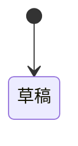

# <F##> UI契約對映

## 模式A:綁定表(有MetaUI)

> 錨定MetaUI `10_UIFlow.md`的P##與頁面`data-*`錨;行為/狀態機/五態歸MetaUI,此處不重複。
> 機檢:operationId/$ref存在於OAS;P##存在於10_UIFlow.md。

| P##或錨 | 動作 | OAS operationId | 畫面欄位→schema $ref | 選單來源 | 錯誤處置(envelope code) | 前置權限 |
|---------|------|-----------------|----------------------|---------|------------------------|---------|
| <!-- P01 / data-action="primary" --> | | | `#/components/schemas/X/properties/y` | `GET /codes/{type}` | | |

## 模式B:行為書六段(無MetaUI)

### 1. 對應SA節點
<!-- F/W節點ref -->
### 2. 動作→端點對映
| 動作 | operationId | 前置權限 | 成功後行為 |
|------|-------------|---------|-----------|
### 3. 狀態機(繼承SA L3,補系統狀態如審核鏈)

### 4. 欄位對映(禁寫型別/必填/選單字面,一律$ref回契約)
| 畫面欄位 | schema $ref | 顯示規則 |
|---------|-------------|---------|
### 5. 錯誤與空狀態
<!-- envelope代碼引用+W99式空狀態語彙 -->
### 6. 權限矩陣
| 角色(RBAC) | 動作 | 允許 |
|------------|------|------|
