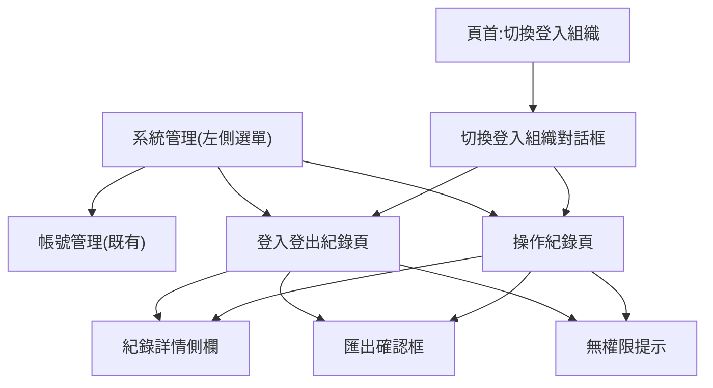

# F01頁面跳轉拓樸(靜態，嚴禁包含邏輯判斷)

## UI元件清單
- `ScopeBanner`:頁首下方說明資料範圍為當前組織(名稱),不跨組織。
- `FilterToggle`:漏斗鈕,展開 / 收合篩選器;收合時以條件標籤顯示目前條件。
- `LogFilter`:篩選器。時間區間(今天 / 近 7 天 / 近 30 天 / 自訂);登入登出頁另有姓名、事件、系統端;操作紀錄頁另有動作(C/R/U/D 勾選)、操作者、操作對象、「含查閱稽核紀錄」勾選。底部按鈕列:清除 / 匯出紀錄 / 查詢。
- `ModuleTabs`(僅操作紀錄頁):全部 / 植栽管理 / 場域管理 / 任務管理 / 帳號管理,附筆數。
- `ResultCount`:「共N筆資料」。
- `Pager`:第N頁下拉 + 上一頁 / 下一頁,沿用帳號管理頁樣式。
- `LoginLogTable`:日期 / 姓名 / 事件(色點)/ 系統端 / 詳情。
- `OpsLogTable`:日期 / 操作者 / 模組・功能 / 動作(C/R/U/D 標籤)/ 操作對象 / 摘要(含「權限異動」標記)/ 詳情。
- `LogDetailDrawer`:右側側欄。基本資料(時間、姓名、帳號、角色、組織、IP、裝置)+ 異動內容(修改前後對照 / 新增或刪除快照 / 查詢條件)。
- `ExportDialog`:組織、範圍筆數、時間區間、格式(Excel / CSV)、上限說明、匯出鈕(產檔中為等待狀態)。
- `AccessDenied`:當前組織角色非系統管理員時的整頁提示。
- `SwitchOrgDialog`:既有元件(選擇登入組織下拉 + 取消 / 確定),屬 M01-F01。
